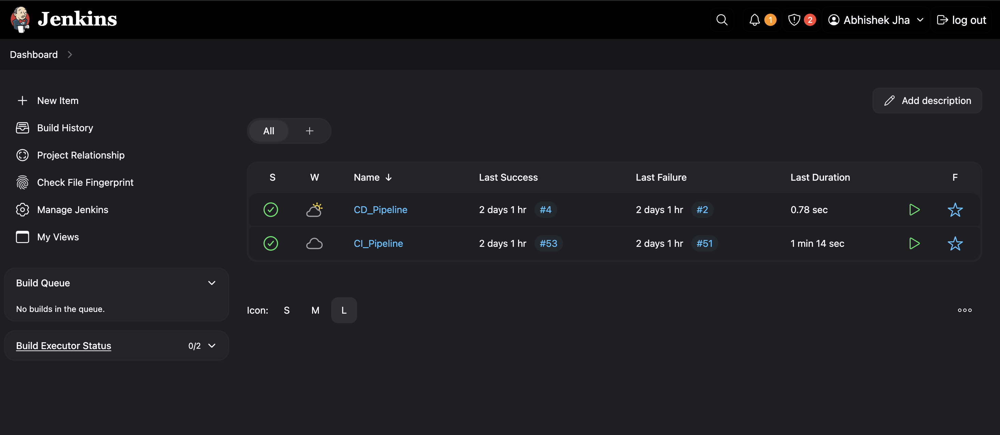
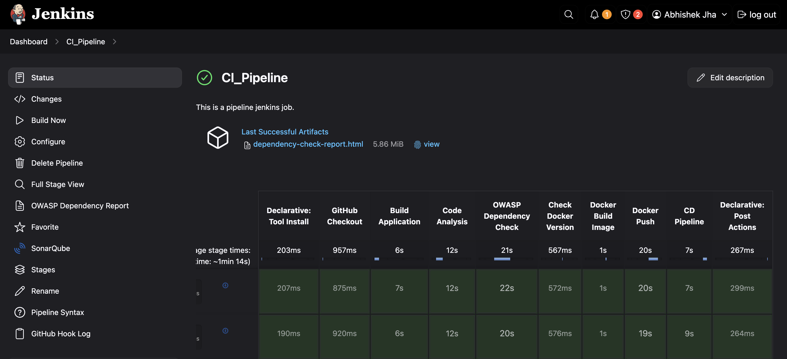
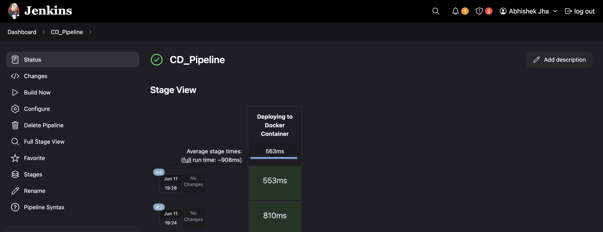

#  🚀 Ekart Web Application – CI/CD Automated using Jenkins

## About

This project showcases a fully automated CI/CD pipeline setup using Jenkins, applied to a Spring Boot-based shopping cart web application.

The core objective was to go beyond just building a Java web application — the focus here was to **implement complete automation** from code analysis to containerized deployment using modern DevOps practices.

💡 What This Project Demonstrates:
- Two Jenkins jobs:

    - CI_Pipeline: Handles code checkout, static code analysis with SonarQube, security vulnerability scanning with OWASP Dependency Check,           builds the application using Maven, creates a Docker image, and pushes it to DockerHub.

    - CD_Pipeline: Automatically triggered by CI_Pipeline, pulls the Docker image and runs the application inside a Docker container exposed on       port 8070.

## 📌 Table of Contents

- [🔧 Tech Stack](#-tech-stack)
- [📁 Project Structure](#-project-structure)
- [⚙️ CI/CD Workflow](#️-cicd-workflow)
  - [CI Pipeline](#ci-pipeline-job)
  - [CD Pipeline](#cd-pipeline-job)
- [🔒 Security & Analysis](#-security--code-analysis)
- [🐳 Dockerization](#-dockerization)
- [📊 Reports & Artifacts](#-reports--artifacts)
- [📌 Final Deployment](#-final-deployment)
- [📷 Screenshots (optional)](#-screenshots-optional)
- [📎 Conclusion](#-conclusion)
- [🙌 Credits](#-credits)

##  🔧 Tech Stack

- **Backend:** Spring Boot, Spring Security, Spring Data JPA, Spring Data REST
- **Frontend:** Thymeleaf
- **Database:** H2 In-Memory Database
- **DevOps & Tools:**  
  - Jenkins (Declarative Pipelines)  
  - SonarQube (Code Quality Analysis)  
  - OWASP Dependency Check (Vulnerability Detection)  
  - Docker & Docker Hub (Containerization & Registry)

## 📁 Project Structure

The project source code is available at:  
➡️ [GitHub Repository](https://github.com/abhijha16/Ekart.git)

It contains:
- Full Spring Boot application with security & persistence.
- A valid `Dockerfile` for containerization.
- Jenkinsfile used in both CI & CD jobs for full automation.

## ⚙️ CI/CD Workflow

### 🏗️ CI Pipeline Job (`CI_Pipeline`)

This pipeline handles everything from fetching the source code to pushing the Docker image:

#### ✅ Stages:

1. **GitHub Checkout**  
   Clones the repository from GitHub to Jenkins workspace.

2. **Code Analysis + Build**  
   - Runs `SonarQube` scan to check code quality and vulnerabilities.
   - Uses Maven to build the project (`mvn clean install -DskipTests=true`) and generate the JAR file.

3. **OWASP Dependency Check**  
   Scans the project dependencies for any known vulnerabilities and generates an HTML report.

4. **Docker Build**  
   Builds a Docker image from the application using the `Dockerfile` in the repository.

5. **Push to DockerHub**  
   Pushes the built Docker image to DockerHub under your repository.

6. **Trigger CD Pipeline**  
   On successful build and checks, automatically triggers the CD pipeline (`CD_Pipeline`).

#### 🧯 Post Blocks:

- **Always Block:**  
  Archives the `dependency-check-report.html` and publishes it to the Jenkins UI for every build.

- **Failure Block:**  
  Displays a message if the pipeline fails and helps in diagnosing issues.

### 🚀 CD Pipeline Job (`CD_Pipeline`)

This pipeline handles deployment:

- Pulls the image from DockerHub.
- Runs the container using Docker.
- Exposes the application at:  
  **http://localhost:8070**

## 🔒 Security & Code Analysis

- **SonarQube Integration:**  
  Checks the code against a quality gate and ensures that only clean, secure code passes.

- **OWASP Dependency Check:**  
  Adds a layer of security by scanning for known vulnerabilities in project dependencies.

## 🐳 Dockerization

The project includes a well-defined `Dockerfile` that:
- Builds the Spring Boot JAR file.
- Sets the application to run in a containerized environment.

Example Docker commands (handled by Jenkins):
```bash
docker build -t abhishek365/ekart .
docker push abhishek365/ekart
docker run -d -p 8070:8080 abhishek365/ekart
```
## Reports & Artifacts

- **OWASP Dependency Report:**
  - Auto-generated and archived inside Jenkins. Viewable from the Jenkins UI post-build.
- **SonarQube Dashboard:
  - Displays quality gate results, code smells, bugs, vulnerabilities, and duplications.

## 📌 Final Deployment

Once CI and CD jobs are triggered:
- The application is deployed in a Docker container.
- It runs automatically on port 8070.
- Ensures every code change is tested, analyzed, containerized, and deployed with zero manual intervention.

## Screenshots
 <br>
 <br>
 <br>

## Conclusion

This project demonstrates how to build a production-like CI/CD setup using Jenkins that:
- Ensures quality and security from the very beginning.
- Automates every step from development to deployment.
- Uses real-world DevOps practices that are valuable in industry setups.

## 🙌 Credits

The original project was forked from [jaiswaladi246/Ekart](https://github.com/jaiswaladi246/Ekart.git)
Automation (CI/CD using Jenkins, SonarQube, Docker, and deployment) was implemented by [Abhishek Jha](https://github.com/abhijha16/Ekart.git)
